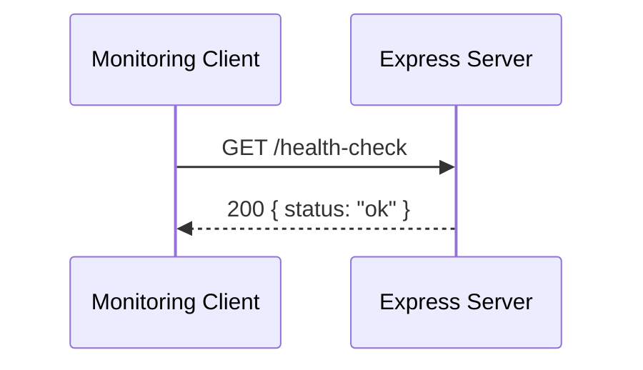

# Health Check Endpoint

## Overview

Pensieve exposes a lightweight HTTP health check endpoint at `GET /health-check`. It returns a JSON response with `{ status: 'ok' }` and a `200` status code, confirming the Express server is running and accepting connections.

The endpoint is registered as part of the Express app created by `createApp` in `app.ts`. The server is started in `index.ts`, which listens on the port defined by the `PORT` environment variable.

This endpoint can be used by container orchestrators, load balancers, or uptime monitors to verify that the Pensieve process is alive.

## Flow

## Components

### createApp

[`createApp`](https://github.com/ilarinie/pensieve/blob/main/packages/server/src/app.ts)

Factory function that creates and configures the Express application. Registers the `/health-check` route, which responds with `{ status: 'ok' }`. Returns the configured Express app instance without starting the server, keeping app creation separate from listening for testability.

### Server entry point

[`index.ts`](https://github.com/ilarinie/pensieve/blob/main/packages/server/src/index.ts)

The process entry point. Calls `createApp()` to get the configured Express app, then starts listening on the port specified by the `PORT` environment variable.

## API Reference

| Method | Path            | Response Code | Response Body        |
| ------ | --------------- | ------------- | -------------------- |
| GET    | `/health-check` | 200           | `{ "status": "ok" }` |

## Related Pages

- [Home](Home) — Project overview and architecture
